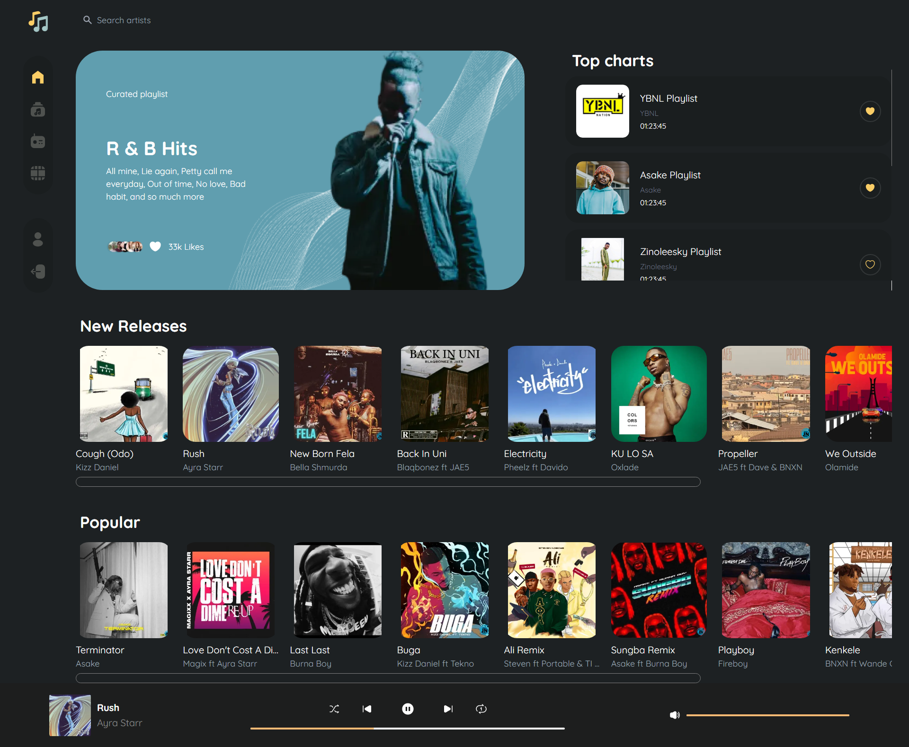
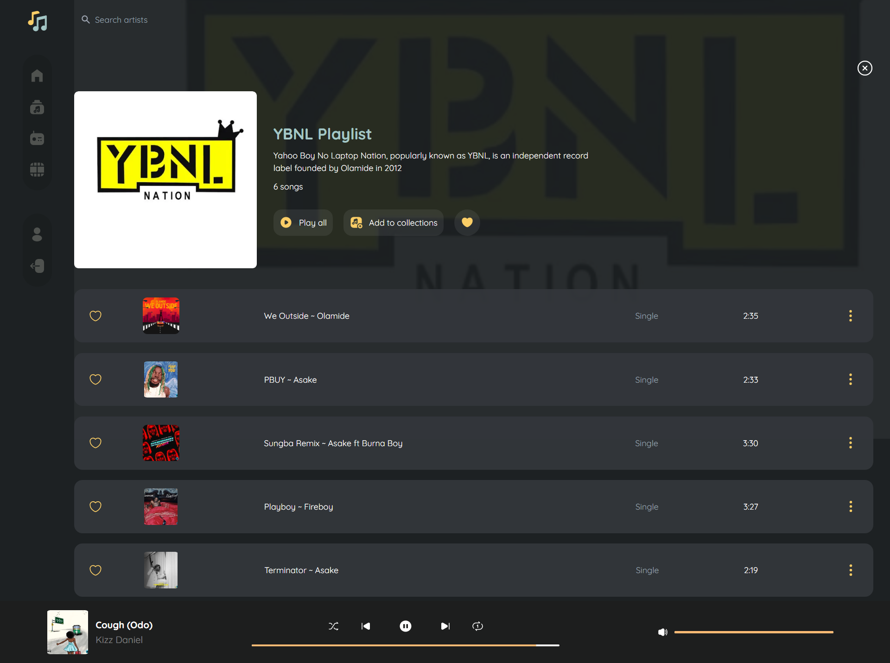
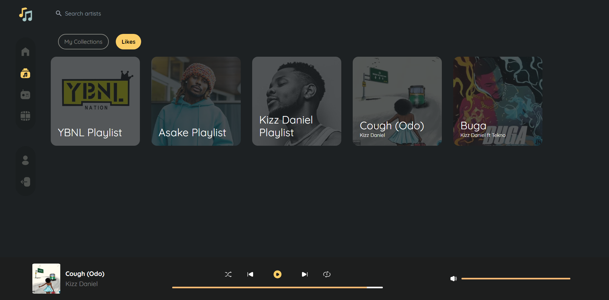
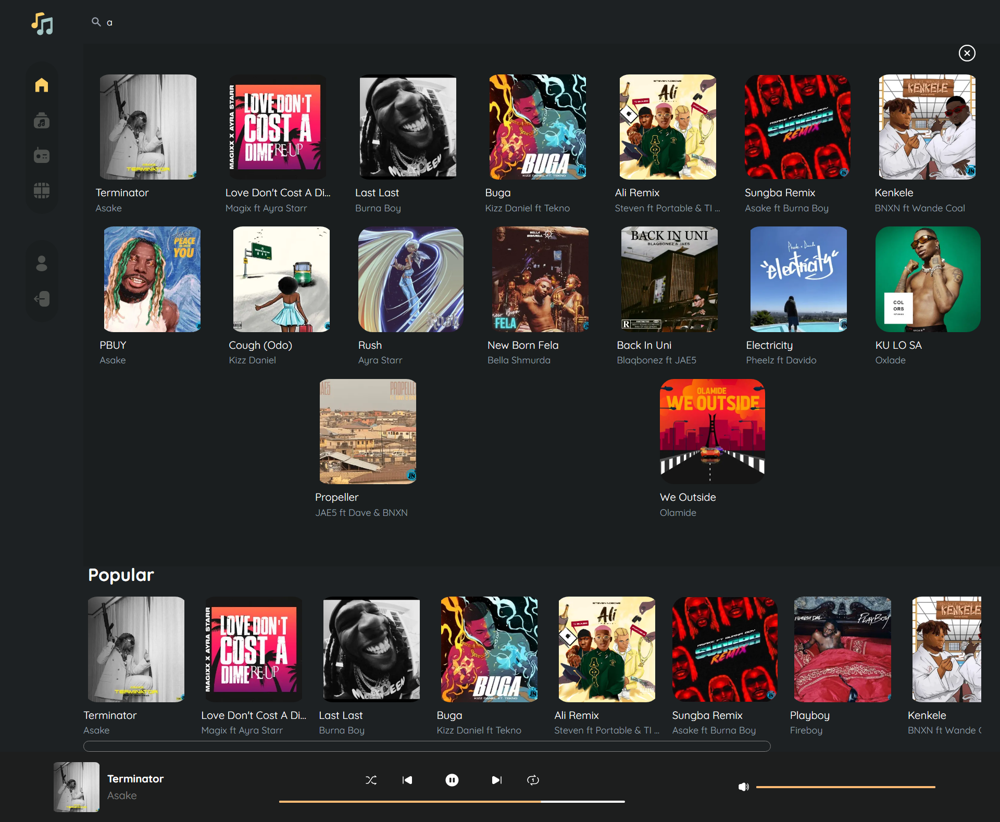
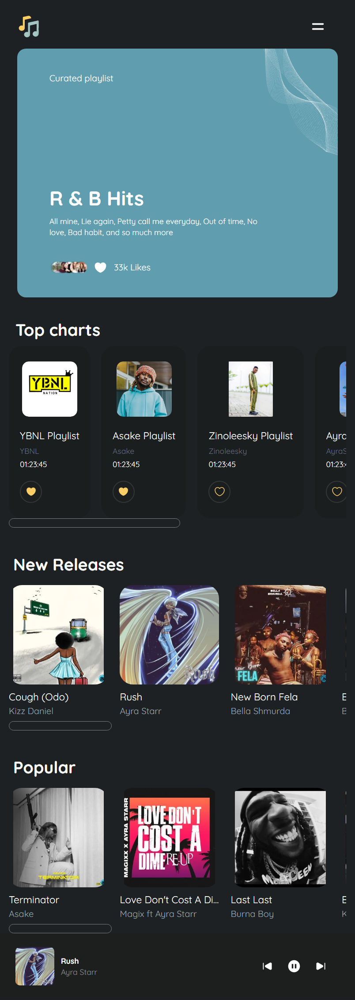
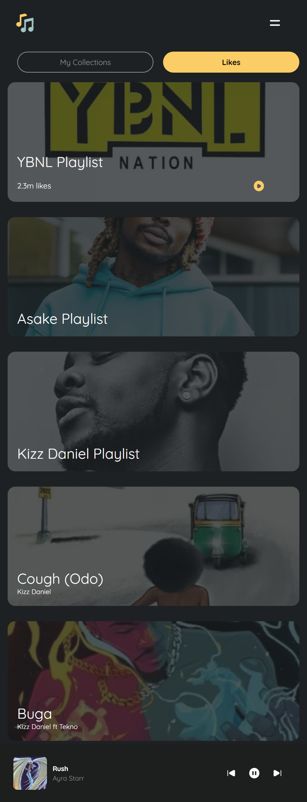

# 🎵 **Welcome to Musica Webapp!**

This is the repo of [codingossy](https://twitter.com/codingossy)'s October challenge named **Musica** 🎵.

 

## 🔄 **Backend update:**

The original custom Musica API (built by Hemdee JS for this challenge) has gone offline, which took the live site down with it. To bring it back, the app now runs on a self-hosted backend built with Next.js API routes (see `/pages/api`), which proxies the free [iTunes Search API](https://developer.apple.com/library/archive/documentation/AudioVideo/Conceptual/iTuneSearchAPI/) to serve real song metadata, cover art, and 30-second preview audio — now curated around Nigerian gospel artists. No frontend UI or logic was changed; only the API base URL was updated.

 

#  ✍🏽 **Overview**

## 🔗 **Links:**

 - [Live link](https://musica-webapp.vercel.app/) to the completed project by me.
 - [Figma link](https://www.figma.com/file/pbwKUpfKPoAcBIgFoXFueS/Musica?node-id=0%3A1) for the challenge.

 

## 🦾 **What I have done in this project:**

 - Users can **Pause**, **Play**, **Prev**, **Next**, **Shuffle** and **Repeat** a song.
 - Users can **Search** for artists.
 - Users can **set the Progress bar**(only on Tablet screen size and above) of a song by **clicking** on the progress bar.
 - Users can **set the volume** by clicking on the volume bar(only on Tablet screen size and above).
 - Users can play any song from the listed songs displayed on the Homepage.
 - When users navigate to a playlist, they can **play all songs** in a playlist, **add/remove** a playlist to a **collection** and also **like/unlike** a playlist.
 - Users can **like/unlike** a song listed on the playlist page(only on Tablet size and above).
 - Users can play any list song from the playlist page.
 - Users can play a song/playlist in the **Collections** page.

 

## 📲 **Screenshots:**

### **Desktop view:**
 
 

 
 

### **Mobile view:**
 
 

## ⚒ **Technologies used:**

 - [NextJS](https://nextjs.org/).
 - [Tailwind CSS](https://tailwindcss.com/docs/installation).
 - ~~[Musica API](https://musica-api.up.railway.app/) (customly made by [Hemdee JS](https://twitter.com/SanusiMuhyideen) for this challenge)~~ — retired, no longer online.
 - [iTunes Search API](https://developer.apple.com/library/archive/documentation/AudioVideo/Conceptual/iTuneSearchAPI/) via a self-hosted Next.js API (current backend).

 

## 📩 **For feedbacks, please reach out to me via:**

 - [Twitter](https://twitter.com/xoluwaseyi)
 - [Gmail](mailto:seyifagbemi211@gmail.com)
