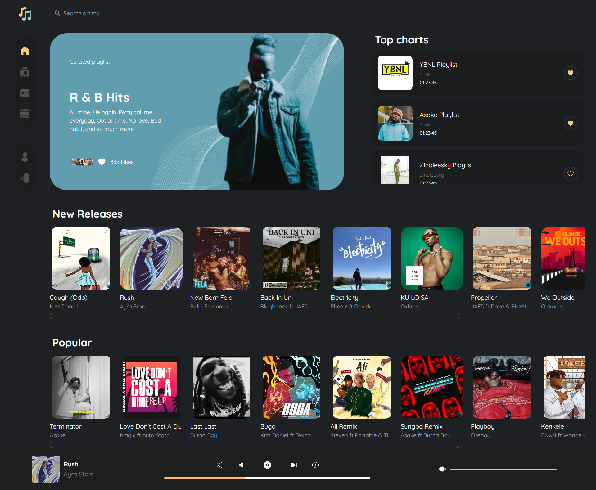
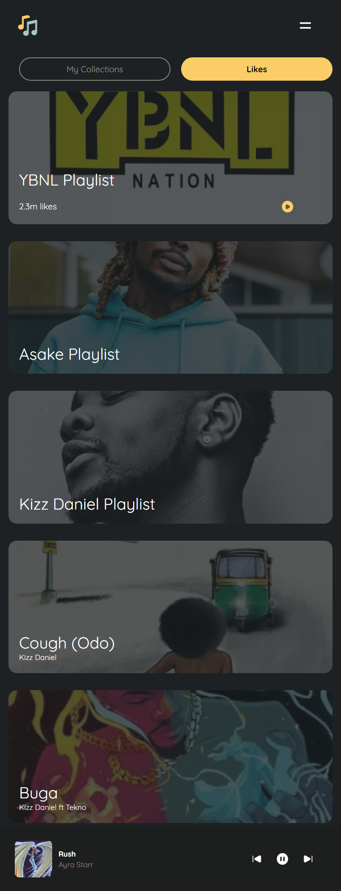

# 🎵 **Welcome to Musica Webapp!**

This is the repo of [codingossy](https://twitter.com/codingossy)'s October challenge named **Musica** 🎵.

 

#  ✍🏽 **Overview**

## 🔗 **Links:**

 - [Live link](https://musica-webapp.netlify.app/) to the completed project by me.
 - [Figma link](https://www.figma.com/file/pbwKUpfKPoAcBIgFoXFueS/Musica?node-id=0%3A1) for the challenge.

 

## 🦾 **What I have done in this project:**

 - Users can **Pause**, **Play**, **Prev**, **Next**, **Shuffle** and **Repeat** a song.
 - Users can **Search** for artists.
 - Users can **set the Progress bar**(only on Tablet screen size and above) of a song by **clicking** on the progress bar.
 - Users can **set the volume** by clicking on the volume bar(only on Tablet screen size and above).
 - Users can play any song from the listed songs displayed on the Homepage.
 - When users navigate to a playlist, they can **play all songs** in a playlist, **add/remove** a playlist to a **collection** and also **like/unlike** a playlist.
 - Users can **like/unlike** a song listed on the playlist page(only on Tablet size and above).
 - Users can play any list song from the playlist page.
 - Users can play a song/playlist in the **Collections** page.

 

## 📲 **Screenshots:**

### **Desktop view:**
 
 

 
 

### **Mobile view:**
 
 

## ⚒ **Technologies used:**

 - [NextJS](https://nextjs.org/).
 - [Tailwind CSS](https://tailwindcss.com/docs/installation).
 - [Musica API](https://musica-api.up.railway.app/) (customly made by [Hemdee JS](https://twitter.com/SanusiMuhyideen) for this challenge).

 

## 📩 **For feedbacks, please reach out to me via:**

 - [Twitter](https://twitter.com/xoluwaseyi)
 - [Gmail](mailto:seyifagbemi211@gmail.com)
